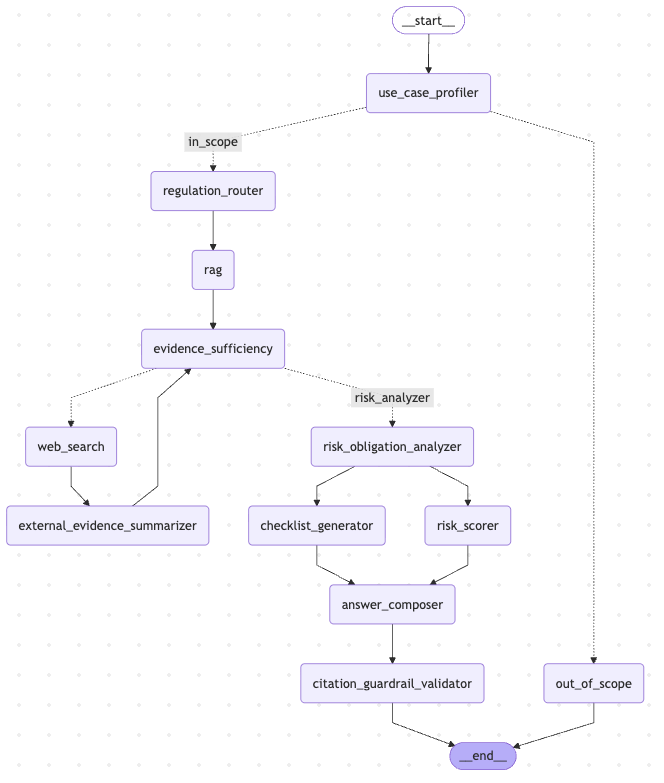

# Enterprise Regulatory Navigator

Agentic RAG chatbot for EU regulatory compliance — built with LangGraph, Python, and local LLMs via Ollama.

Covers **GDPR · DORA · NIS2 · EU AI Act**.

---

## Problem & Motivation

### Why this domain?

EU enterprises must simultaneously comply with four major regulatory frameworks — GDPR, DORA, NIS2, and the AI Act — each with distinct obligations, timelines, and penalties. Compliance teams spend significant time manually searching across hundreds of articles to answer specific questions such as *"does our GenAI chatbot make us subject to the AI Act?"* or *"what are our breach notification obligations under both GDPR and NIS2?"*

### User need

A compliance officer, legal analyst, or engineer who needs accurate, cited answers to regulatory questions — fast, without having to read four 100+ page legal documents.

### Why agentic RAG?

- **Multi-regulation queries** span multiple documents: a single business scenario (e.g. a bank deploying AI) may trigger GDPR, DORA, and the AI Act simultaneously
- **Static keyword search fails**: the answer to *"a bank deploying GenAI"* requires inferring that banking → DORA, AI system → AI Act, customer data → GDPR — with no explicit keywords
- **Authoritative citations matter**: answers must trace back to specific articles, not just plausible text
- **Evidence gaps require fallback**: if the vector store lacks coverage, the agent autonomously falls back to web search on trusted EU regulatory domains

---

## Agent Architecture

### LangGraph Workflow

The agent satisfies all three required agentic properties:

- **Autonomous decision-making** — conditional routing at the evidence sufficiency node
- **Task decomposition and independent execution** — parallel fan-out: `checklist_generator` and `risk_scorer` run concurrently after the risk analysis
- **State management** — `AgentState` TypedDict carries all intermediate results across nodes

### Graph



### Node descriptions

| Node | Type | Role | Notes |
|---|---|---|---|
| `use_case_profiler` | LLM | Extracts `industry`, `intent`, `ai_use_case`, `jurisdiction` from the query | Structured output; uses last 3 conversation turns for multi-turn context; guards against echoing the query as use case |
| `out_of_scope` | Deterministic | Returns fixed refusal for non-regulatory queries | Checked before any RAG/LLM call; uses keyword + industry maps; "How to play Uno?" never reaches the pipeline |
| `regulation_router` | Deterministic | Selects applicable regulations | Dual signal: keyword match on query + profile-aware inference (`banking` → DORA+GDPR, `ai_use_case` present → AI Act); falls back to all regulations |
| `rag` | Tool | Two-stage retrieval: bi-encoder top-20 + cross-encoder top-5 | Calls `rag_retrieval_tool`; returns evidence list, score, regulations covered, gaps |
| `evidence_sufficiency` | Deterministic | Decides whether to proceed or trigger web search | `score ≥ 0.55 AND no gaps` → analysis; otherwise → web search (max 2 iterations); **autonomous decision-making node** |
| `web_search` | Tool | Searches Tavily on 5 trusted EU regulatory domains | Calls `web_search_tool`; queries built from coverage gaps; increments iteration counter |
| `external_evidence_summarizer` | LLM | Summarises web results; merges into evidence; recomputes score | Gaps cleared if new score crosses threshold |
| `risk_obligation_analyzer` | LLM | Extracts risks, obligations, severity from evidence | Structured output (`RiskAssessmentOutput`); graceful fallback if evidence is empty |
| `checklist_generator` | LLM | Converts obligations into `- [ ] verb ...` checklist | Runs **in parallel** with `risk_scorer` |
| `risk_scorer` | Deterministic | Weighted composite risk score 0–1 | Calls `risk_scoring_tool`; runs **in parallel** with `checklist_generator`; demonstrates independent subtask execution |
| `answer_composer` | LLM | Composes structured answer (fan-in from both parallel nodes) | Free-form generation, `temperature=0.1`; no JSON schema avoids answer compression on small models |
| `citation_guardrail_validator` | LLM | Validates citations against retrieved evidence | Structured output; returns `valid`, `issues`, `corrected_answer`; self-corrects hallucinated article numbers |

### Tools

The workflow integrates **3 tools** — RAG retrieval (retrieval) and web search + risk scoring (non-retrieval):

| Tool | Type | Description |
|---|---|---|
| `rag_retrieval_tool` | Retrieval | BGE bi-encoder + cross-encoder reranker over ChromaDB |
| `web_search_tool` | External search | Tavily, restricted to trusted EU regulatory authority domains |
| `risk_scoring_tool` | Computation | Deterministic composite risk score based on regulation + severity |

### RAG Subgraph

A dedicated, modular LangGraph subgraph — callable from the main workflow but not counted in the main node count. It encapsulates the full retrieval pipeline independently.

```
retrieve (top 20) → rerank (top 5) → build_evidence → END
```

#### 1. Document ingestion & chunking

Regulatory PDFs are processed with a **structure-aware chunking strategy** rather than a naive sliding window.

**Why not a plain sliding window?**
A fixed-size sliding window (e.g. 512 tokens, step 256) would frequently split mid-article, mixing the end of Article 33 with the beginning of Article 34 in the same chunk. For a legal RAG system, this creates two critical problems:
- **Citation accuracy suffers** — the chunk can no longer be attributed to a single article
- **Retrieval precision drops** — the embedding represents a blend of two different legal obligations rather than one coherent concept

**The structure-aware approach:**
1. Split on legal boundaries first: `Article N`, `Recital N`, `Chapter`, `Section`, `Annex` — detected by regex
2. Only if a legal unit exceeds the token budget does it fall back to a sliding token window (450 tokens, 64 overlap)
3. Token counting uses the **BGE tokenizer** (`BAAI/bge-base-en-v1.5`) — not a character estimate — so counts are exact for the embedding model

**Why 450 tokens and 64 overlap?**
`BAAI/bge-base-en-v1.5` has a hard maximum of 512 tokens including `[CLS]` and `[SEP]` special tokens. 450 leaves 62 tokens of headroom. The 64-token overlap is intentional but small: EU regulatory text is self-referencing ("as referred to in Article 12(3)"), so large overlaps add noise rather than context.

Each chunk carries structured metadata: `doc_name`, `document_type`, `article`, `page_start`, `page_end`, `chunk_index`, `token_count` — enabling precise citation in the final answer.

#### 2. Two-stage retrieval

| Stage | Model | Candidates | Why |
|---|---|---|---|
| Bi-encoder (ANN) | `BAAI/bge-base-en-v1.5` | top 20 | Fast approximate search; embeds query and chunks independently |
| Cross-encoder (reranker) | `BAAI/bge-reranker-base` | top 5 | Scores full (query, passage) pairs; captures token-level interactions |

The bi-encoder casts a wide net cheaply. The cross-encoder then re-scores the top 20 with higher precision — it sees the query and passage together and can model relevance interactions that cosine similarity misses.

Both models are **loaded once at startup** as thread-safe singletons with double-checked locking.

#### 3. EvidencePack

The subgraph builds a structured `EvidencePack` with:

```python
class EvidencePack(BaseModel):
    query:               str
    evidence:            list[Evidence]   # top-5 reranked chunks with metadata
    evidence_score:      float            # composite quality score 0–1
    regulations_covered: list[str]        # e.g. ["GDPR", "AI Act"]
    sufficient:          bool             # score >= threshold and no gaps
    gaps:                list[str]        # missing required regulations
```

#### 4. Evidence sufficiency scoring

The composite score drives the web search fallback decision:

```
score = 0.50 × avg_relevance
      + 0.25 × source_diversity    (1.0 if ≥3 sources, 0.75 if 2, 0.5 if 1)
      + 0.25 × regulation_coverage (1.0 if ≥3 regulations covered, 0.75/0.5/0.0)
```

If `score < 0.55` **or** required regulations are missing from the retrieved evidence, the main agent triggers web search fallback (max 2 iterations).

#### 5. Regulation filter

The retriever supports a `regulations` filter — e.g. `["GDPR", "NIS2"]` — that restricts the ChromaDB query to chunks from specific documents using a `$in` metadata filter. This prevents AI Act chunks from polluting a GDPR-specific query.

### Model choice

| Component | Model | Reason |
|---|---|---|
| LLM | `qwen3:1.7b` via Ollama | No paid API; runs locally on Apple Silicon GPU; fast enough for a prototype |
| Embedding | `BAAI/bge-base-en-v1.5` | State-of-the-art open-source bi-encoder; 512-token context matches chunk size |
| Reranker | `BAAI/bge-reranker-base` | Cross-encoder reranker; higher precision than cosine similarity alone |

**Trade-offs of Qwen3 1.7B:** Significantly lower quality than GPT-4o or Claude Sonnet on complex legal reasoning. Structured output (JSON schema) occasionally fails or compresses answers. Compensated by explicit prompting and a citation validator node that self-corrects. Advantage: zero cost, full local privacy, no rate limits.

---

## Data Source

Four official EU regulatory PDFs placed in `data/raw/`:

| File | Regulation | Pages |
|---|---|---|
| `gdpr.pdf` | General Data Protection Regulation | ~88 |
| `dora.pdf` | Digital Operational Resilience Act | ~79 |
| `nis2.pdf` | NIS2 Directive | ~80 |
| `ai_act.pdf` | EU Artificial Intelligence Act | ~144 |

**Processing emphasis:** structure-aware chunking (splits on Article/Recital/Chapter headings first, then token windows) ensures chunks align with legal units rather than arbitrary text windows.

---

## Project Structure

```
enterprise-regulatory-navigator/
├── ui/
│   └── app.py                        Streamlit UI
├── tests/
│   ├── test_agent.py                 End-to-end agent test + Mermaid export
│   ├── test_rag.py                   RAG pipeline smoke test
│   ├── eval.py                       Functional evaluation (20 queries)
│   └── load_test.py                  Load test (50–200 queries)
├── src/regulatory_navigator/
│   ├── agent/
│   │   ├── nodes/                    One file per graph node
│   │   │   ├── profiler.py
│   │   │   ├── out_of_scope.py
│   │   │   ├── router.py
│   │   │   ├── rag.py
│   │   │   ├── sufficiency.py
│   │   │   ├── web_search.py
│   │   │   ├── summarizer.py
│   │   │   ├── analyzer.py
│   │   │   ├── checklist.py
│   │   │   ├── risk_scorer.py
│   │   │   ├── composer.py
│   │   │   └── validator.py
│   │   ├── tools/
│   │   │   ├── rag_retrieval.py
│   │   │   ├── web_search.py
│   │   │   └── risk_scoring.py
│   │   ├── graph.py                  Graph assembly + compile
│   │   ├── routing.py                Conditional edge functions
│   │   ├── state.py                  AgentState TypedDict
│   │   ├── llm.py                    LLM factory (Ollama)
│   │   └── prompts.py                All LLM prompt strings
│   └── rag/
│       ├── chunking.py               Structure-aware PDF → Chunks
│       ├── embeddings.py             BGE embedding model
│       ├── retriever.py              ChromaDB vector search
│       ├── reranker.py               Cross-encoder reranking
│       ├── evidence.py               EvidencePack builder
│       ├── ingest.py                 Ingestion pipeline
│       ├── state.py                  RAGState TypedDict
│       └── subgraph.py               RAG LangGraph subgraph
├── data/
│   ├── raw/                          Source PDFs
│   └── vectorstore/                  ChromaDB persistent index (pre-built, tracked in git)
├── results/                          Evaluation and load test JSON outputs
├── pyproject.toml
└── .env
```

---

## Installation & Setup

### Prerequisites

- Python 3.13+
- [Ollama](https://ollama.com) installed
- [uv](https://docs.astral.sh/uv/) package manager

### 1. Clone and install

```bash
git clone <repo-url>
cd enterprise-regulatory-navigator
uv pip install -e .
```

### 2. Pull the LLM

```bash
ollama pull qwen3:1.7b
```

### 3. Configure environment

```bash
cp .env.example .env   # then fill in your keys
```

```env
TAVILY_API_KEY=tvly-...              # free at app.tavily.com

# Optional — LangSmith observability
LANGCHAIN_TRACING_V2=true
LANGCHAIN_API_KEY=ls__...
LANGCHAIN_PROJECT=enterprise-regulatory-navigator
```

### 4. Ingest regulatory PDFs (optional — vectorstore is pre-built)

The `data/vectorstore/` directory is tracked in git. You only need to re-ingest if you add new PDFs:

```bash
uv run python -m regulatory_navigator.rag.ingest
```

### 5. Start Ollama

```bash
OLLAMA_NUM_PARALLEL=8 OLLAMA_MAX_QUEUE=512 OLLAMA_KEEP_ALIVE=24h ollama serve
```

### 6. Launch the UI

```bash
uv run streamlit run ui/app.py
```

---

## Functional Evaluation

### Methodology

Evaluated on two nodes:
1. **Use Case Profiler (LLM node)** — does it correctly extract industry, AI use case, and intent?
2. **RAG Retrieval** — does it retrieve the correct regulation and article?

Validation set: **20 queries** (17 in-scope + 3 noise), covering all 4 regulations and 3 cross-regulation scenarios.

```bash
uv run python tests/eval.py
```

### Results

**Use Case Profiler**

| Metric | Score | Notes |
|---|---|---|
| AI use case detection | **100%** | Correctly identifies presence/absence of AI use case |
| Industry match | **67%** | Fails on generic queries with no industry context |
| Intent match | **12%** | Metric limitation: Qwen returns specific strings ("notification obligations") vs expected broad keywords ("compliance") |
| Overall accuracy | **12%** | Driven by the strict intent matching — not reflective of actual routing quality |

**RAG Retrieval**

| Metric | Score | Notes |
|---|---|---|
| Regulation hit rate | **100%** | Correct regulation retrieved every time |
| Keyword hit rate | **94%** | Expected keywords appear in retrieved text |
| Article hit rate | **76%** | Specific article number not always in top-5 chunks |
| Mean evidence score | **0.596** | Below the 0.65 threshold used at eval time → web search always triggered |
| Web search rate | **100%** | Vector store alone insufficient at this threshold; tuned to 0.55 in production (see load test) |

**Robustness (noise queries)**

| Metric | Score |
|---|---|
| Correctly routed out-of-scope | **100%** (3/3) |

*"How to play Uno?", "Best chocolate cake recipe?", "FIFA World Cup 2022?" — all correctly rejected before reaching RAG.*

### Key conclusions

1. RAG regulation retrieval is **100% accurate** — the right framework is always found
2. The web search fallback always fired at eval time because evidence scores (~0.596) fell below the then-current 0.65 threshold. The threshold was subsequently tuned to 0.55, reducing the web search rate to ~60% in the load test
3. Profiler AI use case detection is a **clear strength** (100%)
4. The intent metric is **too strict** for a 1.7B model — fuzzy matching would give a more realistic picture

---

## Load Test

### Setup

```bash
OLLAMA_NUM_PARALLEL=8 OLLAMA_MAX_QUEUE=512 OLLAMA_KEEP_ALIVE=24h ollama serve
uv run python tests/load_test.py --repeat 5 --workers 4
```

### Results (10 queries × 5 repeats = 50 total, 4 workers, qwen3:1.7b)

| Metric | Value |
|---|---|
| Successful / Total | 47 / 50 |
| Errors | 3 (6%) — structured output parsing failures under load |
| Wall-clock time | 5389.9s (~90 min) |
| Throughput | 0.009 queries/s |
| Mean latency | 326.4s |
| Median latency | 231.1s |
| p75 | 252.5s |
| p90 | 293.1s |
| p95 | 327.9s |
| p99 | 2432.4s |
| Min / Max | 144.7s / 2440.6s |
| Web search rate | 59.6% |

The large p99 (2432s) vs p95 (328s) gap indicates a small number of severe outliers — likely queries that exhausted the web search retry loop or hit Ollama queue timeouts under peak contention.

The **web search rate dropped from 100% to 59.6%** compared to earlier runs, reflecting the tuned sufficiency threshold (0.55).

### Per-node bottleneck analysis

| Node | Mean latency | Type | Notes |
|---|---|---|---|
| `checklist_generator` ¹ | **~183s** | LLM | Primary bottleneck in the parallel fan-out pair |
| `answer_composer` | 67.1s | LLM | Free-form composition after fan-in |
| `risk_obligation_analyzer` | 34.3s | LLM | Structured output over full evidence |
| `external_evidence_summarizer` | 28.8s | LLM | Conditional — only when web search fires |
| `use_case_profiler` | 20.3s | LLM | First node; includes structured output |
| `web_search` | 3.4s | Tavily API | Fast; conditional |
| `rag` | 2.0s | Embedding + reranking | Local model |
| `evidence_sufficiency` | <0.1s | Deterministic | |
| `regulation_router` | <0.1s | Deterministic | |

¹ Due to parallel execution ordering in the trace, the measured duration for `checklist_generator` is attributed to `risk_scorer` in the raw JSON. The ~183s reflects the LLM call latency of `checklist_generator` — the bottleneck of the parallel pair — since `answer_composer` waits for both to complete.

> **Note on concurrency:** Each query makes 4–6 sequential LLM calls. With 4 concurrent workers, up to 24 simultaneous Ollama requests compete for 8 parallel slots, causing heavy queuing and the high latency observed. Sequential mode (`--workers 1`) yields ~90-120s per query on this setup.

### Optimisation suggestions

**1. Model tiering**
Use `qwen3:1.7b` for lightweight nodes (profiler, router, validator) and a faster quantised model (e.g. `qwen3:8b-q4`) only for `answer_composer` and `risk_obligation_analyzer`. The profiler and validator together account for ~20s that could drop to ~5s with a smaller model. Expected improvement: 30–50% total latency reduction.

**2. Pre-warm embeddings at startup**
Pre-load `BAAI/bge-base-en-v1.5` and `BAAI/bge-reranker-base` at application startup to eliminate the cold-start penalty (~2–3s) on the first real query. This directly improves p95 for short-running deployments.

**3. Replace local Ollama with a cloud LLM API**
The dominant cost is local GPU inference. Switching to a cloud-hosted model (e.g. Gemini Flash, Groq) would significantly reduce LLM latency and enable true parallel concurrency without Ollama queue contention. The system is already designed for this — swapping providers requires only setting `LLM_PROVIDER=gemini` with no code changes.

---

## Docker

### Quick start (recommended)

```bash
cp .env.example .env   # add TAVILY_API_KEY
docker compose up --build
```

Open [http://localhost:8501](http://localhost:8501).

The first startup pulls `qwen3:1.7b` (~1GB) and the BGE models automatically. Subsequent starts use the cached volumes.

### Services

| Service | Image | Port | Notes |
|---|---|---|---|
| `app` | Built from `Dockerfile` | 8501 | Streamlit UI + agent |
| `ollama` | `ollama/ollama:latest` | 11434 | LLM inference server |

### Volumes

| Volume | Contents |
|---|---|
| `ollama_models` | LLM weights — persisted across restarts |
| `hf_cache` | HuggingFace models (BGE embedding + reranker) |

### How it works

The `docker-entrypoint.sh` script:
1. Waits for the Ollama service to become healthy
2. Pulls `qwen3:1.7b` via the Ollama API (skipped if already cached)
3. Starts Streamlit

### GPU note

Docker on Mac cannot pass Metal GPU through to containers — Ollama will run on CPU inside Docker, which is significantly slower than the native setup. For local development, running Ollama natively (`ollama serve`) and the app with `uv run streamlit run ui/app.py` is recommended. Docker is provided for reproducibility and deployment.

---

## Running the Tests

```bash
# End-to-end agent test + Mermaid graph export
uv run python tests/test_agent.py

# RAG pipeline smoke test
uv run python tests/test_rag.py

# Functional evaluation (20 queries)
uv run python tests/eval.py

# Load test
uv run python tests/load_test.py --repeat 5 --workers 4
uv run python tests/load_test.py --repeat 1 --workers 1   # quick smoke test
```
